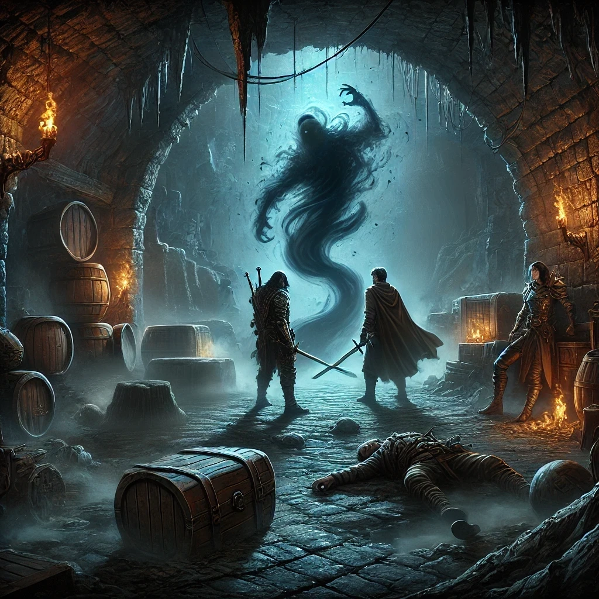

#### **Introducción: Encuentro en la ciudad**

La aventura comenzó en el bullicioso mercado de la ciudad, donde los personajes tuvieron sus primeros enfrentamientos.

- **Eryndor** intentó perseguir a un ladrón halfling que había robado una bolsa, pero su intento de intimidación no fue exitoso, y el pequeño logró escapar.
- **Faiorath**, en un giro inesperado, contrató a un **cargador** para que lo ayudara a recuperar la bolsa. Este cargador, de nombre **Garvan**, resultó ser un humano robusto y amable, con una historia humilde como trabajador de puertos. Su intervención fue clave para atrapar al halfling, aunque no pudieron obtener toda la información deseada.
- **Nestorius**, con su actitud protectora, se mantuvo crítico de las decisiones de los demás, pero finalmente todos coincidieron en la necesidad de seguir las pistas hacia la cueva de los bandidos.

---

#### **El camino a la cueva: Tensiones y decisiones**

En el viaje hacia la cueva, surgieron desacuerdos entre los personajes:

- **Faiorath** quiso recolectar hierbas para su cerbatana, lo que generó una disputa con **Eryndor**, quien prefería avanzar sin demora.
- **Nestorius**, siempre pragmático, intentó imponer su autoridad al exigir compensaciones si se retrasaban, lo que llevó a una breve pero divertida partida de "piedra, papel o tijera" entre **Faiorath** y **Eryndor**, con **Faiorath** saliendo victorioso.

Finalmente, avanzaron hacia la cueva, con **Faiorath** al frente buscando trampas, lo que evitó una emboscada inesperada.

---

#### **Dentro de la cueva: Exploración y combate**

En la cueva, el grupo mostró su creatividad y valentía:

- **Faiorath** descubrió un extraño líquido en un charco y decidió guardarlo para experimentos futuros.
- Un enfrentamiento con dos halflings iniciales demostró el ingenio del grupo, con **Nestorius** utilizando su fe y habilidades para proteger al equipo mientras **Faiorath** y **Eryndor** derrotaban a los enemigos con precisión.

Momentos destacados:

1. **Eryndor** usó un golpe crítico con su espada larga, mostrando su destreza en combate.
2. **Nestorius**, a pesar de su baja salud, curó a **Eryndor** y mantuvo su liderazgo.
3. **Faiorath** mezcló el polvo incendiario que encontró en la cueva con sus dardos, aumentando su arsenal.

---

#### **La infiltración y la caída de Kellin**

Utilizando su ingenio, **Faiorath** se disfrazó del líder humano derrotado y logró infiltrarse en la cámara principal de la cueva, engañando a los guardias y **Kellin Duskwhisper**.

- Mientras **Nestorius** y **Eryndor** fingían ser prisioneros, **Faiorath** manipuló la situación para sembrar el caos, provocando tensiones entre los guardias.
- En el combate que siguió, el grupo mostró una gran coordinación:
    - **Nestorius** dio el golpe final a **Kellin**, aplastándolo con su maza.
    - **Eryndor**, en un acto intimidante, cortó la cabeza de **Kellin** y la exhibió, logrando que uno de los halflings huyera.

---

#### **La aparición de la figura sombría**

Cuando todo parecía resuelto, una **figura sombría** emergió de las profundidades de la cueva. Esta entidad, rodeada de un aura oscura y sobrenatural, dejó claro que **Kellin** no era más que un peón en un juego mucho más grande.

- **Nestorius**, reconociendo la gravedad de la amenaza, utilizó **Llama Sagrada** para cegar temporalmente a la figura, permitiendo que el grupo escapara.
- **Eryndor** y **Faiorath** guiaron al grupo fuera de la cueva, dejando atrás la cámara cargada de peligros y misterio.

---

#### **Momentos memorables:**

- El contrato con el **cargador Garvan**, un aliado inesperado pero eficiente.
- Las tensiones cómicas entre **Faiorath** y **Eryndor** durante la recolección de hierbas.
- La táctica de infiltración y engaño de **Faiorath** con su disfraz teatral.
- El giro final con la aparición de la **figura sombría**, dejando al grupo con más preguntas que respuestas.

---

#### **Cierre de la sesión:**

El grupo escapó con vida, pero ahora sabe que hay una amenaza mucho mayor acechando en las sombras. La conexión entre los artefactos, **Kellin**, y la entidad oscura será clave para el futuro. Con su liderazgo probado y su ingenio demostrado, los personajes tendrán que prepararse para el desafío que se avecina.

**Frase final de la sesión:**  
_"¿Creyeron que acababan con el líder de todo esto? ¿De verdad pensaron que las sombras desaparecerían tan fácilmente?"_ — Figura sombría.

